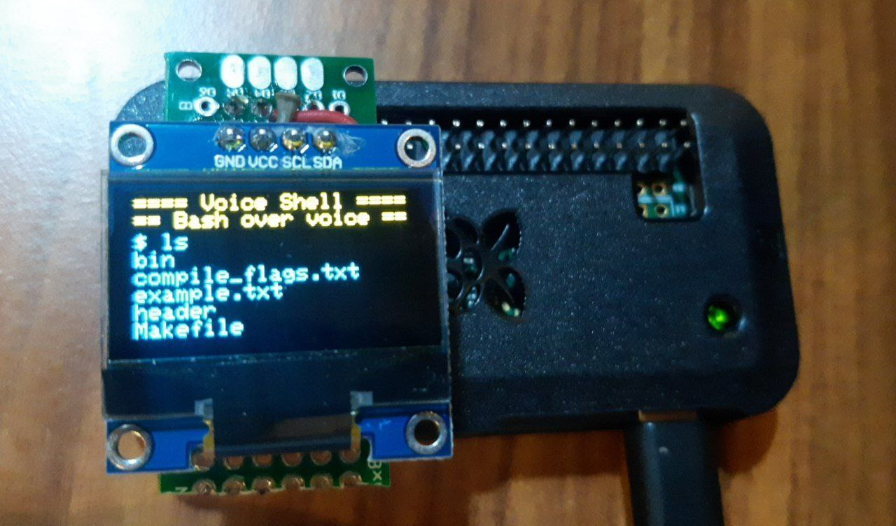
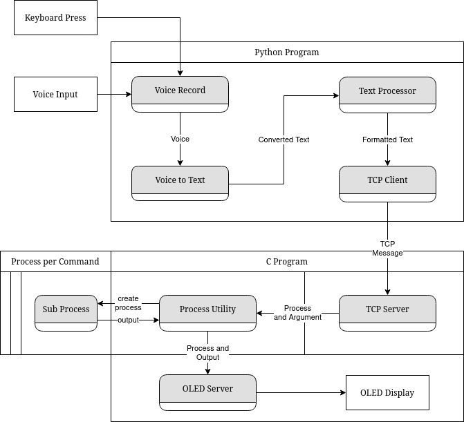
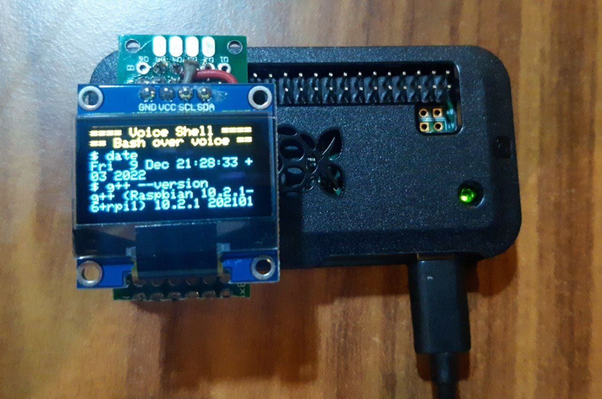

<p align="center">
  <a href="https://github.com/umutsevdi/unix-assistant">
  <h3 align="center"> Unix Assistant</h3>
  </a>

<p align="center">  
A voice assistant tool on OLED displays for running shell commands
  <br/>
    <i>Developed by <a href="https://github.com/umutsevdi"> Umut Sevdi</a>,
    <a href="https://github.com/Selimshady">Yavuz Selim Cagan</a>,
    <a href="https://github.com/semihyazici">Semih Yazici</a> and
    <a href="https://github.com/Oguzhanercan">Oguzhan Ercan</a>.</i>

<p align="center"><a href="doc/GS_proje_rapor.pdf"><strong>Explore the docs »
</strong></a></p>

<details open="open">
  <summary>Table of Contents</summary>
  <ol>
    <li><a href="#project_definition">Project Definition</a></li>
    <li><a href="#system_architecture">System Architecture</a></li>
    <li><a href="#hardware">Hardware Requirements</a></li>
    <li><a href="#installation">Installation</a></li>
    <li><a href="LICENSE">License</a></li>
    <li><a href="#contact">Contact</a></li>
  </ol>
</details>

<p align="center"></p>

<p id="project_definition">

## 1. Project Definition

Unix Assistant is a voice controlled UNIX Shell that is displayed on the OLED screens.
Works on Raspberry Pi or any embedded device running UNIX like operating systems.

In our project we used Raspberry Pi Zero running [Rasbian](https://www.raspberrypi.com/software/).

By clicking to the button, our software records the voice and converts it into a
valid UNIX shell command. After that our software executes the command and displays
it's output on OLED screen.

<p id="system_architecture">

## 2. System Architecture

Our software is written in C, C++ and Python. Voice recording and processing is done
in Python. Everything related to the OLED display is done in C and C++.

After successfully processing the voice data, the text is transferred through sockets
to the C program. The C program then executes the incoming command in a separate
process and it's result is transferred to the main program via pipes. When the command
and it's result is obtained, they are both printed to the OLED screen on the current
cursor position.

- For button control we used [RPi.GPIO](https://pypi.org/project/RPi.GPIO/).
- For voice control and processing we used [PyAudio](https://pypi.org/project/PyAudio/).
- To control the OLED display we used [SSD1306_OLED_RPI](https://github.com/gavinlyonsrepo/SSD1306_OLED_RPI)
  and [bcm2835](https://www.airspayce.com/mikem/bcm2835/).

<p align="center"></p>

### Voice Processing Program

Our program starts execution by obtaining the IP address that matches its own `hostname`
and connects to it.
Then enters an infinite loop. During the loop, it expects user input is
given from the keyboard to record the sound for 5 seconds.

Data recording is completed by using
`data = sd.rec(samplerate * duration, samplerate=samplerate, channels=1, blocking=True).`
The sound obtained is then brought to a suitable range with
`data= ( data * abs_max + abs_max).clip(0,abs_max).astype(np.int16)`
before being written to the disk.
Then, the voice is read from the file and sent to the Google TTS API.
The final message obtained
after passing through the `text_processor(text:str)` function is based on the
response from the API. This function converts the incoming message into a command
format that can be executed. If the words are found in the pre-defined command
dictionary, they are replaced.
If the final message obtained after the text_processor function is not null,
it is sent to the C program on the other side via TCP message.

### Display and Execution Program

Our program is written as a multi-process so that the OLED screen can continue
to process messages while the program is running.
The first process is responsible for controlling the OLED screen and running
the programs, while the second process acts as the TCP server.
Since our program runs in two different processes, a pipe structure is used
for communication between the two programs. The TCP server takes the writing
end of the pipe, while the display program takes the reading end.

- #### Display Process

  This process first needs to make various settings.
  The function `int disp_setup(pid_t p)` is run to set up the OLED display.
  This function introduces the OLED screen to the program and creates an
  `SSD1306` object based on the _disp_width_ and _disp_height_ values given.
  This class contains functions related to the display.
  After that, the function `void disp_loop(int read_pipe)` is executed.
  This function prints a text on the screen and starts to listening the
  reading end of the pipe. The following actions are taken as long as
  a message other than "exit" is received:

  - If the message is "clear", the OLED screen is cleared.
  - If not, the display cursor is placed at the y_index * 8 % 64 position
    it should be. It then calls the function
    `char *proc_exec(char *const program, int len)`defined in `proc_util`.

    "proc_exec" first calls the function
    `char **proc_split(const char *const string, int len, int *argc)` defined
    in the same header. This function parses the given string into a program
    and arguments.

  - After the parsing is complete, `proc_exec` creates a new process and executes
    the program and argument data of the process. It redirects `stdout` and `stderr`
    channels to the write end of the pipe. This allows the output of the
    created process to be stored in a string.
  - `disp_loop` writes the program name and result obtained to the OLED buffer
    and updates the screen. If the screen overflows as a result, the screen is cleared.
  - If the message is "exit", the OLED screen and TCP server processes are
    terminated instead of the shell's exit command. OLED and TCP are terminated by
    calling the function `void OLED_exit()` defined in the same header.
  - If none of these conditions are met, the message is simply written to the OLED
    screen.

<p align="center"></p>

- #### TCP Server Process

  This process runs `void serv_loop(int write_pipe)` function. This function creates
  a socket and listens on port 8081. When a connection is received, it reads
  the incoming message and writes it to the write end of the pipe. If the received
  message is "exit", the function terminates the server and closes the socket.

<p id="hardware">

### 3. Hardware Requirements

We developed our project using Raspberry Pi Zero.
The OLED screen and Raspberry's 4th pin are connected to each other.
The 1st, 3rd, 5th, and 6th pins of the Raspberry Pi are used.
3.3V is obtained from the 1st pin. Data flow is provided for communication to occur
via the 3rd pin. A common clock is used to ensure proper serial communication via
the 5th pin.
Finally, the OLED's ground pin is connected to the Raspberry Pi's ground pin,
which is the 6th pin.

<p id="installation">

### 4. Installation

1. Clone the repo

```sh
   git clone https://github.com/umutsevdi/unix-assistant.git
```

2. Download the dependencies to the Raspberry Pi.

   - C Dependencies:

     - [bcm2835](https://www.airspayce.com/mikem/bcm2835/)
     - [SSD1306_OLED_RPI](https://github.com/gavinlyonsrepo/SSD1306_OLED_RPI)

   - Python Dependencies:

     - numpy
     - SciPy
     - sounddevice
     - SpeechRecognition
     - PyAudio

   - Additional Dependencies:

```sh
sudo apt install portaudio19-dev python3-pyaudio
```

3. Compile the C++ program.

```sh
    cd app/
    make all
```

4. Run the C++ program under root privileges.

```sh
    sudo bin/test
```

4. Run the Python program.

```sh
    python main.py
```

## 5. License

Distributed under the MIT License. See `LICENSE` for more information.

<p id="contact">

## 6. Contact

You can contact any developer of this project for any suggestion or information.

Project: [umutsevdi/unix-assistant](https://github.com/umutsevdi/unix-assistant)

<i>Developed by <a href="https://github.com/umutsevdi"> Umut Sevdi</a>,
<a href="https://github.com/Selimshady">Yavuz Selim Cagan</a>,
<a href="https://github.com/semihyazici">Semih Yazici</a> and
<a href="https://github.com/Oguzhanercan">Oguzhan Ercan</a>.</i>
